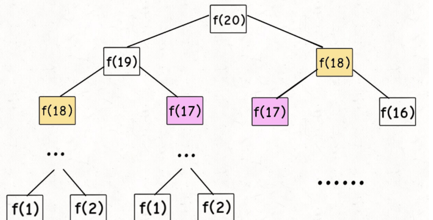
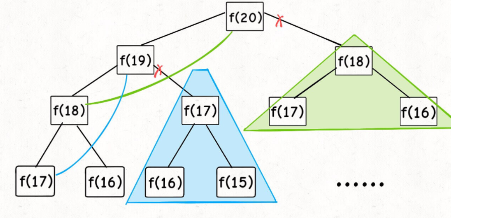
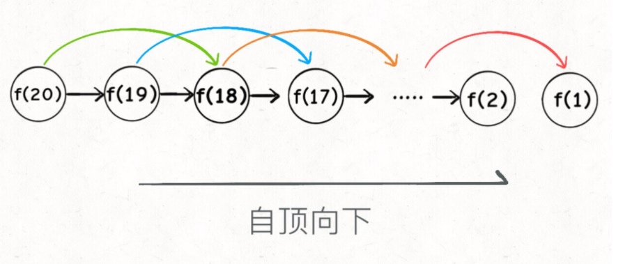
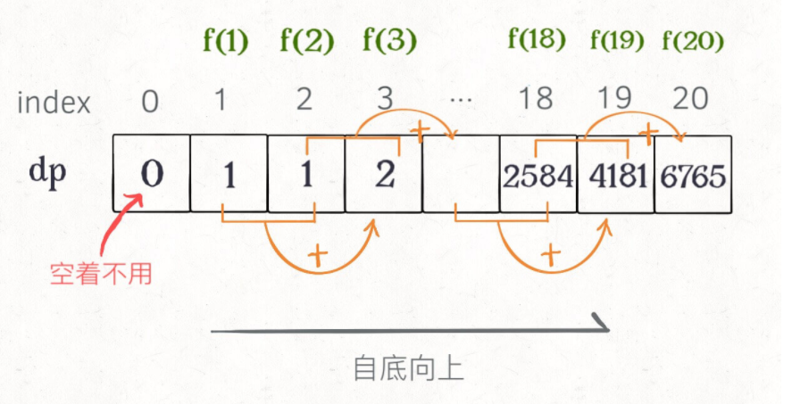
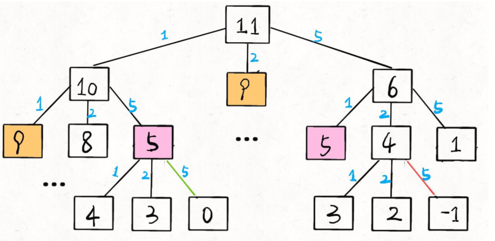

# 动态规划

用来解决的问题：**一般形式就是求最值**。动态规划其实是运筹学的一种最优化方法，只不过在计算机问题上应用比较多，比如说让你求**最长**递增子序列呀，**最小**编辑距离呀等等

求最值的的核心问题：**就是穷举法**

动态规划的穷举的特点：这类问题存在 **重叠子问题**，如果暴力穷举，效率会极其低下，所以需要备忘录或者DP table 来优化穷举过程，避免不必要的过程。同时这类问题一定会**具备最优子结构**，才能通过子问题的最值问题得到原问题的最值。

另外，虽然动态规划的核心思想就是穷举求最值，但是问题可以千变万化，穷举所有可行解其实并不是一件容易的事，只有列出**正确的「状态转移方程」**，才能正确地穷举。

以上提到的重叠子问题、最优子结构、状态转移方程就是动态规划三要素。但是在实际的算法问题中，**写出状态转移方程是最困难的**

#### **明确 base case -> 明确「状态」-> 明确「选择」 -> 定义 dp 数组/函数的含义**。

```python
# 初始化 base case
dp[0][0][...] = base
# 进行状态转移
for 状态1 in 状态1的所有取值：
    for 状态2 in 状态2的所有取值：
        for ...
            dp[状态1][状态2][...] = 求最值(选择1，选择2...)
```

### 例题解析

#### leetcode 509  斐波那契数列问题 （斐波那契数列没有求最值，所以严格来说不是动态规划问题）

1.暴力递归

```python
int fib(int N) {
    if (N == 1 || N == 2) return 1;
    return fib(N - 1) + fib(N - 2);
}
```

​		但凡遇到需要递归的问题，最好都画出递归树，这对你分析算法的复杂度，寻找算法低效的原因都有巨大帮助

​		

#### 递归算法的时间复杂度怎么计算？就是用子问题个数乘以解决一个子问题需要的时间。

首先计算子问题个数，即递归树中节点的总数。显然二叉树节点总数为指数级别，所以子问题个数为 O(2^n)。然后计算解决一个子问题的时间，在本算法中，没有循环，只有` f(n - 1) + f(n - 2) `一个加法操作，时间为 O(1)。

所以，这个算法的时间复杂度为二者相乘，即 O(2^n)，指数级别，爆炸。

观察递归树，很明显发现了算法低效的原因：存在大量重复计算，比如 `f(18)` 被计算了两次，而且你可以看到，以 `f(18)` 为根的这个递归树体量巨大，多算一遍，会耗费巨大的时间。更何况，还不止 `f(18)` 这一个节点被重复计算，所以这个算法及其低效

动态规划问题的第一个性质：**重叠子问题** 

### 带备忘录的递归解法 来解决重叠问题

​	那么我们可以造一个「备忘录」，每次算出某个子问题的答案后别急着返回，先记到「备忘录」里再返回；每次遇到一个子问题先去「备忘录」里查一查

```PYTHON
 def fib(self, n: int) -> int:
        result = dict()
        for i in range(1,n+1):
            result[i] = 0
        def helper(n:int,demo:dict):
            if n==0:return 0
            if n==1 or n==2:return 1
            if demo[n] != 0:
                return demo[n]
            demo[n] = helper(n-1,demo)+helper(n-2,demo)
            return demo[n]
        return helper(n,result)
```

带「备忘录」的递归算法，把一棵存在巨量冗余的递归树通过「剪枝」，改造成了一幅不存在冗余的递归图，极大减少了子问题（即递归图中节点）的个数。



递归算法：都是自顶向下



递归算法的时间复杂度怎么计算？就是用子问题个数乘以解决一个子问题需要的时间

​	子问题个数，即图中节点的总数，由于本算法不存在冗余计算，子问题就是 `f(1)`, `f(2)`, `f(3)` ... `f(20)`，数量和输入规模 n = 20 成正比，所以子问题个数为 O(n)。解决一个子问题的时间，同上，没有什么循环，时间为 O(1)。所以，本算法的时间复杂度是 O(n)。比起暴力算法，是降维打击

自顶向下：注意我们刚才画的递归树（或者说图），是从上向下延伸，都是从一个规模较大的原问题比如说 `f(20)`，向下逐渐分解规模，直到 `f(1)` 和 `f(2)` 这两个 base case，然后逐层返回答案，这就叫「自顶向下」。

自底向上:们直接从最底下，最简单，问题规模最小的 `f(1)` 和 `f(2)` 开始往上推，直到推到我们想要的答案 `f(20)`，这就是动态规划的思路，这也是为什么动态规划一般都脱离了递归，而是由循环迭代完成计算

#### dp 数组的迭代解法

我们可以把这个「备忘录」独立出来成为一张表，就叫做 DP table 吧，在这张表上完成「自底向上」



而且你发现这个 DP table 特别像之前那个「剪枝」后的结果，只是反过来算而已。实际上，带备忘录的递归解法中的「备忘录」，最终完成后就是这个 DP table

引出「状态转移方程」这个名词，实际上就是描述问题结构的数学形


「状态转移方程」？其实就是为了听起来高端。你把 `f(n)` 想做一个状态 `n`，这个状态 `n` 是由状态 `n - 1` 和状态 `n - 2` 相加转移而来，这就叫状态转移，仅此而已

斐波那契数列的状态转移方程，当前状态只和之前的两个状态有关，其实并不需要那么长的一个 DP table 来存储所有的状态，只要想办法存储之前的两个状态就行了。所以，可以进一步优化，把空间复杂度降为 O(1)：

```python
    def fib1(self, n: int):
        pre,next = 1,1
        for i in range(3, n + 1):
            result = pre + next
            pre = next
            next = result
        return result
```

这个技巧就是所谓的「**状态压缩**」，如果我们发现每次状态转移只需要 DP table 中的一部分，那么可以尝试用状态压缩来缩小 DP table 的大小，只记录必要的数据，上述例子就相当于把DP table 的大小从 `n` 缩小到 2。后续的动态规划章节中我们还会看到这样的例子，一般来说是把一个二维的 DP table 压缩成一维，即把空间复杂度从 O(n^2) 压缩到 O(n)

#### leetcode 322 凑零钱问题

这个问题是动态规划问题，因为它具有「最优子结构」的。**要符合「最优子结构」，子问题间必须互相独立**。

回到凑零钱问题，为什么说它符合最优子结构呢？比如你想求 `amount = 11` 时的最少硬币数（原问题），如果你知道凑出 `amount = 10` 的最少硬币数（子问题），你只需要把子问题的答案加一（再选一枚面值为 1 的硬币）就是原问题的答案。因为硬币的数量是没有限制的，所以子问题之间没有相互制，是互相独立的

**如何列出正确的状态转移方程**？

1、**确定 base case**，这个很简单，显然目标金额 `amount` 为 0 时算法返回 0，因为不需要任何硬币就已经凑出目标金额了.

2、**确定「状态」，也就是原问题和子问题中会变化的变量**。由于硬币数量无限，硬币的面额也是题目给定的，只有目标金额会不断地向 base case 靠近，所以唯一的「状态」就是目标金额 `amount`。

3、**确定「选择」，也就是导致「状态」产生变化的行为**。目标金额为什么变化呢，因为你在选择硬币，你每选择一枚硬币，就相当于减少了目标金额。所以说所有硬币的面值，就是你的「选择」。

4、**明确** **`dp`** **函数/数组的定义**。我们这里讲的是自顶向下的解法，所以会有一个递归的 `dp` 函数，一般来说函数的参数就是状态转移中会变化的量，也就是上面说到的「状态」；函数的返回值就是题目要求我们计算的量。就本题来说，状态只有一个，即「目标金额」，题目要求我们计算凑出目标金额所需的最少硬币数量。所以我们可以这样定义 `dp` 函数：

### 暴力递归

dp(n)  n 目标金额

```python
    def coinChange(self, coins: List[int], amount: int) -> int:
        def dp(n):
            '''n 代表金额'''
            if n==0:return 0
            if n <0:return -1
            res = float('inf')
            for coin in coins:
                subproblem = dp(n-coin)
                #子问题无解 跳过
                if subproblem ==-1: continue
                res = min(res,1+subproblem)
            return res if res!=float('inf') else -1
        return dp(amount)

```

状态转移方程其实已经完成了，以上算法已经是暴力解法了，以上代码的数学形式就是状态转移方程：


这个问题其实就解决了，只不过需要消除一下重叠子问题，比如 `amount = 11, coins = {1,2,5}` 时画出递归树看看：



子问题总数为递归树节点个数，这个比较难看出来，是 O(n^k)，总之是指数级别的。每个子问题中含有一个 for 循环，复杂度为 O(k)。所以总时间复杂度为 O(k * n^k)，指数级别。

#### 带备忘录的递归

```python
    def coinChange1(self,coins: List[int], amount: int):
        memo =dict()
        def dp(n):
            if n in memo:return memo[n]
            #base case
            if n == 0:return 0
            if n < 1 :return -1
            res = float('inf')
            for coin in coins:
                subproblem = dp(n-coin)
                if subproblem ==-1:continue
                res = min(res,1+subproblem)
            memo[n] = res if res!=float('inf') else -1
            return memo[n]
        return dp(amount)
```

#### dp 数组的迭代解法

​	自底向上使用 dp table 来消除重叠子问题，关于「状态」「选择」和 base case 与之前没有区别，`dp` 数组的定义和刚才 `dp` 函数类似，也是把「状态」，也就是目标金额作为变量。不过 `dp` 函数体现在函数参数，而 `dp` 数组体现在数组索引：

​	**`dp`** **数组的定义：当目标金额为** **`i`** **时，至少需要** **`dp[i]`** **枚硬币凑出**


### 其他

1、到底什么才叫「最优子结构」，和动态规划什么关系。

2、为什么动态规划遍历`dp`数组的方式五花八门，有的正着遍历，有的倒着遍历，有的斜着遍历，有的无论咋遍历都是对的。

#### 最优子结构

「最优子结构」是某些问题的一种特定性质，并不是动态规划问题专有的。也就是说，很多问题其实都具有最优子结构，只是其中大部分不具有重叠子问题。

例子:假设你们学校有 10 个班，你已经计算出了每个班的最高考试成绩。那么现在我要求你计算全校最高的成绩，你会不会算？当然会，而且你不用重新遍历全校学生的分数进行比较，而是只要在这 10 个最高成绩中取最大的就是全校的最高成绩。

​	这个例子就**符合最优子结构**：可以从子问题的最优结果推出更大规模问题的最优结果。让你算**每个班**的最优成绩就是子问题，你知道所有子问题的答案后，就可以借此推出**全校**学生的最优成绩这个规模更大的问题的答案

这么简单的问题都有最优子结构性质，只是因为显然没有重叠子问题，所以我们简单地求最值肯定用不出动态规划

另外一个例子:

​	假设你们学校有 10 个班，你已知每个班的最大分数差（最高分和最低分的差值）。那么现在我让你计算全校学生中的最大分数差，你会不会算？可以想办法算，但是肯定不能通过已知的这 10 个班的最大分数差推到出来。因为这 10 个班的最大分数差不一定就包含全校学生的最大分数差，比如全校的最大分数差可能是 3 班的最高分和 6 班的最低分之差

这个例子就**不符合最优子结构**，因为你没办通过每个班的最优值推出全校的最优值，没办法通过子问题的最优值推出规模更大的问题的最优值

**想满足最优子结，子问题之间必须互相独立。全校的最大分数差可能出现在两个班之间，显然子问题不独立，所以这个问题本身不符合最优子结构**。

**那么遇到这种最优子结构失效情况，怎么办？策略是：改造问题**改造问题，也就是把问题等价转化：最大分数差，不就等价于最高分数和最低分数的差么，那不就是要求最高和最低分数么

### dp 数组的遍历方向

​	**1、遍历的过程中，所需的状态必须是已经计算出来的**。

​    **2、遍历的终点必须是存储结果的那个位置**。