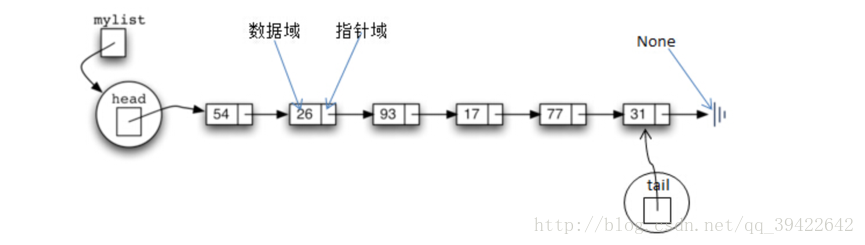
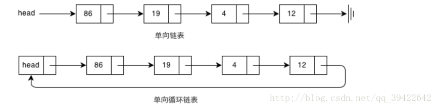

# 链表结构（linked list）

#### 基本结构

链表是通过一个个节点组成的，每个节点都包含了称为cargo的基本单元，它也是一种递归的数据结构。它能保持数据之间的逻辑顺序，但存储空间不必按照顺序存储。

如图：

​	

链表的基本元素有：

- 节点：每个节点有两个部分，左边部分称为值域，用来存放用户数据；右边部分称为指针域，用来存放指向下一个元素的指针。
- head:head节点永远指向第一个节点
- tail: tail永远指向最后一个节点
- None:链表中最后一个节点的指针域为None值

但链表也分为单向链表和单向循环链表，双向链表和双向循环链表，如图为单向链表和单向循环链表：



python 链表定义

```python
class Node:
    def __init__(self,item = None, next = None):
        self.item = item
        self.next = next
    def __str__(self):
        #测试基本功能，输出字符串
        return str(self.cargo)
#__str__是打印的函数
```


### 链表的基本操作

---


在链表的基本操作中，包括插入，删除等，但要注意的是一下的操作是针对非循环链表的，从头节点开始操作，而且我们不能插入 None值到链表中。

​	基本操作：

#### 打印链表

#### 计算链表长度

#### 插入（从前或者从后插入）

#### 查找

#### 删除

申请两个变量，如果遇到匹配的，不用删除，直接将匹配节点的前一节点指向匹配节点的下一节点，因此需要定义一个前节点和一个当前节点，当前节点用来判断是否与输入数据匹配，前节点用来更改链表的指向。

若输入数据为None,返回
将头节点设置为前节点，头节点的下一个节点设置为当前节点
判断前节点是否与输入数据匹配，若匹配，将头节点设置为当前节点
遍历整个链表，若当前节点与输入数据匹配，将前节点的指针指向当前节点的下一个节点，否则，移到下一个节点

### 循环链表

​	表中最后一个结点的指针域指向头结点，整个链表形成一个环

```python
class Node(object):

    def __init__(self, item):
        self.item = item
        self.next = None
        self.prev = None
```

### 双向链表

双向链表每个数据结点中都有两个指针，分别指向直接后继和直接前驱，所以从双向链表中的任意一个结点开始，都可以很方便地访问它的前驱结点和后继结点

```python
class Node(object):

  	 def __init__(self, item):
        self.item = item
        self.next = None
        self.prev = None
```
剑指offer 
003-从尾到头打印链表
014-链表中倒数第k个结点
015-反转链表
016-合并两个或k个有序链表
025-复杂链表的复制
036-两个链表的第一个公共结点
055-链表中环的入口结点
056-删除链表中重复的结点

leetcode
2	Add Two Numbers	
19	Remove Nth Node From End of List	
24	Swap Nodes in Pairs	
61	Rotate List	
82	Remove Duplicates from Sorted List II	
83	Remove Duplicates from Sorted List	
86	Partition List	
92	Reverse Linked List II
141	Linked List Cycle	
142	Linked List Cycle II	
160	Intersection of Two Linked Lists	
203	Remove Linked List Elements	
206	Reverse Linked List	
234	Palindrome Linked List	
237	Delete Node in a Linked List


